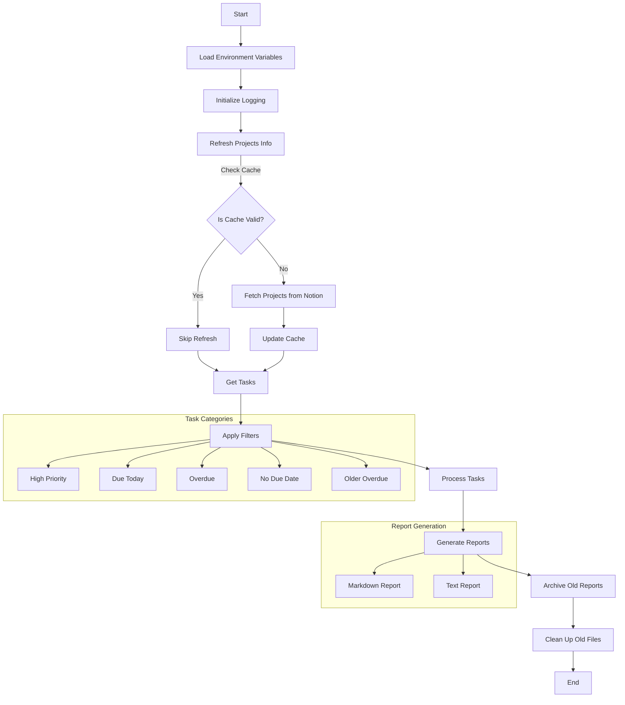

# Notion Tasks Report Generator

Hello. This is a personal project I built to help me stay organized with my Notion tasks. As someone who loves using Notion for task management but often found myself missing important deadlines, I created this tool to give me a clear daily overview of what needs my attention.

## Why I Built This

I found myself spending too much time manually checking my Notion tasks and trying to prioritize them. I needed a birds eye view to:
- Quickly identify high-priority tasks that need immediate attention
- Never miss tasks due today
- Keep track of overdue items before they pile up
- See which tasks are associated with which projects

This script helps me achieve all of that by automatically generating a clean, organized report every day. I hope it can help others who are in a similar situation!

## Features

- 📊 Generates both Markdown and plain text reports
- 🔥 Highlights high-priority tasks
- 📅 Tracks tasks due today
- ⚠️ Monitors overdue tasks (within last 7 days)
- 📝 Includes project associations
- 🔄 Automatically archives old reports
- 📋 Maintains a clean target directory

## Prerequisites

- Python 3.x
- Notion API access
- Required Python packages (see `requirements.txt`)

## Setup

1. Clone this repository
2. Install dependencies:
   ```bash
   pip install -r requirements.txt
   ```
3. Create a `.env.dev` file with your Notion credentials:
   ```
   NOTION_API_KEY=your_api_key_here
   NOTION_TASKS_DB=your_tasks_database_id
   NOTION_PROJECTS_DB=your_projects_database_id
   SAMPLE_TASK_PAGE_ID=your_sample_task_id
   ```

## Usage

Simply run:
```bash
python main.py
```

The script will generate two files in the `target` directory:
- `tasks_report.md`: A formatted Markdown report
- `tasks_report.txt`: A plain text version of the report

## How It Works

Here's a visual representation of what happens when you run the script:



## Report Structure

The generated report includes:

1. **High Priority Tasks**
   - Tasks marked as high priority
   - Due on or before today
   - Not marked as "Done"

2. **Due Today Tasks**
   - Tasks due today
   - Not marked as "Done"

3. **Overdue Tasks**
   - Tasks overdue within the last 7 days
   - Not marked as "Done"

4. **Additional Notes**
   - Count of tasks overdue for more than 7 days
   - Count of tasks with no due date

## Maintenance

- Reports are automatically archived with timestamps
- Old reports (>7 days) are automatically cleaned up
- Project information is cached for 24 hours
- Comprehensive logging for debugging

## Contributing

I'd love to see how others use and improve this tool! Feel free to:
- Submit issues if you find bugs
- Suggest new features
- Fork the repository and make improvements
- Share how you're using it in your workflow

## License

This project is licensed under the MIT License - see the LICENSE file for details.

## About Me

I'm a software developer passionate about productivity tools and automation. This project is part of my journey to build better tools for personal task management. You can find me on GitHub or connect with me on LinkedIn to discuss this project or other interesting ideas!

---
Made with ❤️ by Chakradhar 